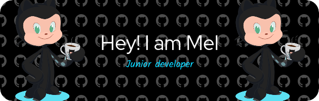

<!---->

  

<!--[Header](./github-header-image.png)-->
<!--

  

-->

<!--

  
  

  
  
  

-->

<!--
Profile view counter

  

-->

---

🪧 About me/Interests:
<pre>
  • 💼 dev Web/IT 
  • 💵 Frelance/Upwork 
  • 📖 System/Algorithm 
  • 🎮 Game Dev
  • 💡 IA 
  • 💻 Code
</pre>

---

### :fire: My tools :

  <!-- Web -->
  
  
  
  
  
  
  
  
  
  
  
  
  
  
  
  
  
  
  

  <!-- DB -->
  
  
  

  <!-- Gaming Tools -->
  
  

  <!-- Icons and other-->
  
  
  
  
  

  

 
 

---

### :fire: My Stats :
<!---->

  

  

---
### 🤝 Social : 
<pre>
You can follow me on <a href="https://app.daily.dev">dailydev</a>
</pre>

  

<!---->

